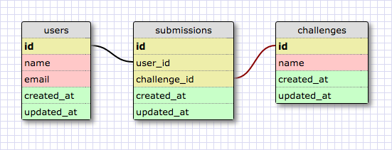

# SQLite3-Queries-101
## Most Common Queries

Below are the most common queries one should know when beginning to learn SQL. Before jumping into queries, it's important to understand the relationship between databases. This is especially vital for JOIN queries.



Some things to note:
- The user table only has access to challenges THROUGH submissions
- Vice versa, the challenges table only has access to users THROUGH submissions
- Therefore, submissions is JOIN table
- Understanding relationships are important. In SQL and real life :P

### SELECT

Ex 1. Get all the data for all the submissions.

  ```sql
SELECT * FROM submissions;
```
Results:
  ```sql
1|1|1|2016-08-12 13:50:08|2016-08-12 13:50:08
2|2|1|2016-08-12 13:50:08|2016-08-12 13:50:08
3|3|1|2016-08-12 13:50:08|2016-08-12 13:50:08
4|3|2|2016-08-12 13:50:08|2016-08-12 13:50:08
5|4|2|2016-08-12 13:50:08|2016-08-12 13:50:08
6|5|2|2016-08-12 13:50:08|2016-08-12 13:50:08
7|6|3|2016-08-12 13:50:08|2016-08-12 13:50:08
8|6|3|2016-08-12 13:50:08|2016-08-12 13:50:08
9|7|4|2016-08-12 13:50:08|2016-08-12 13:50:08
10|8|4|2016-08-12 13:50:08|2016-08-12 13:50:08
11|9|4|2016-08-12 13:50:08|2016-08-12 13:50:08
12|10|1|2016-08-12 13:50:08|2016-08-12 13:50:08
13|10|4|2016-08-12 13:50:08|2016-08-12 13:50:08
14|1|2|2016-08-12 13:50:08|2016-08-12 13:50:08
15|1|2|2016-08-12 13:50:08|2016-08-12 13:50:08
16|2|5|2016-08-12 13:50:08|2016-08-12 13:50:08
17|2|5|2016-08-12 13:50:08|2016-08-12 13:50:08
18|3|6|2016-08-12 13:50:08|2016-08-12 13:50:08
19|4|5|2016-08-12 13:50:08|2016-08-12 13:50:08
20|5|7|2016-08-12 13:50:08|2016-08-12 13:50:08
```
### WHERE

Ex 1. Show all the data for any submissions made for the challenge with id 1.
  ```sql
SELECT * FROM submissions WHERE challenge_id = 1;
```
Results:
  ```sql
1|1|1|2016-08-12 13:50:08|2016-08-12 13:50:08
2|2|1|2016-08-12 13:50:08|2016-08-12 13:50:08
3|3|1|2016-08-12 13:50:08|2016-08-12 13:50:08
12|10|1|2016-08-12 13:50:08|2016-08-12 13:50:08
```
Ex 2. Show the names and email addresses of any users with a "@gmail.com" email address.
  ```sql
SELECT name, email FROM users WHERE email LIKE "%@gmail.com%";
```
Results:
  ```sql
Dustin Wells|dustin@gmail.com
Jane X. Miller|jane@gmail.com
Raymond Oakley|raymond@gmail.com
Floyd Belle|floyd@gmail.com
Latoya Butler|latoya@gmail.com
Linda Davis|linda@gmail.com
Lisa Nguyen|lisapizza@gmail.com
```
### JOIN

Ex 1. Show the names and email addresses of any users who made a submission for the challenge named "sinatra-vs-rails".
  ```sql
SELECT users.name, users.email FROM users JOIN submissions ON users.id = submissions.user_id JOIN challenges ON challenge_id = challenges.id WHERE challenges.name LIKE '%sinatra-vs-rails%';
```
Results:
  ```sql
Gerald Woodard|gerald@outlook.com
Ray Locke|ray@yahoo.com
Jane Miller|jane@gmail.com
Dustin Wells|dustin@gmail.com
Dustin Wells|dustin@gmail.com
```
Ex 2. Show all the data for submissions made by the user named "Jason Parker".
  ```sql
SELECT * FROM submissions JOIN users ON users.id = submissions.user_id WHERE users.name = 'Jason Parker';
```
Results:
  ```sql
12|10|1|2016-08-12 13:50:08|2016-08-12 13:50:08|10|Jason Parker|jason@outlook.com|2016-08-12 13:50:08|2016-08-12 13:50:08
13|10|4|2016-08-12 13:50:08|2016-08-12 13:50:08|10|Jason Parker|jason@outlook.com|2016-08-12 13:50:08|2016-08-12 13:50:08
```
Ex 3. Show the names of any users who made a submission to any challenge whose name includes "rails".
  ```sql
SELECT users.name FROM users JOIN submissions ON users.id = submissions.user_id JOIN challenges ON challenge_id = challenges.id WHERE challenges.name LIKE '%rails%';
```
Results:
  ```sql
Dustin Wells
George Wilson
Gerald Woodard
Gerald Woodard
Ray Locke
Jane X. Miller
Jackie McNeil
Jackie McNeil
Jason Parker
Dustin Wells
Dustin Wells
George Wilson
George Wilson
Ray Locke
```
Ex 4. Show the names of all the challenges for which the user named "Ray Locke" made a submission.xx
  ```sql
SELECT * FROM challenges JOIN submissions ON challenges.id = submissions.challenge_id JOIN users ON submissions.user_id = users.id WHERE users.name = 'Ray Locke';
```
Results:
  ```sql
2|sinatra-vs-rails|2016-08-12 13:50:08|2016-08-12 13:50:08|5|4|2|2016-08-12 13:50:08|2016-08-12 13:50:08|4|Ray Locke|ray@yahoo.com|2016-08-12 13:50:08|2016-08-12 13:50:08
5|api-only-rails|2016-08-12 13:50:08|2016-08-12 13:50:08|19|4|5|2016-08-12 13:50:08|2016-08-12 13:50:08|4|Ray Locke|ray@yahoo.com|2016-08-12 13:50:08|2016-08-12 13:50:08
```
### INSERT

Ex 1. Add a new user.
  ```sql
INSERT into users (name, email, created_at, updated_at) VALUES ("Lisa Nguyen", "lisapizza@gmail.com", "2016-12-19 15:32:10", "2016-12-19 15:32:10");
```
Check new record:
  ```sql
SELECT * FROM users WHERE name = "Lisa Nguyen";
```
Results:
  ```sql
14|Lisa Nguyen|lisapizza@gmail.com|2016-12-19 15:32:10|2016-12-19 15:32:10
Paste output here.
```

Ex 2. Add a new challenge.
  ```sql
INSERT INTO challenges (name, created_at, updated_at) VALUES ("word-search", "2016-12-19 15:32:10", "2016-12-19 15:32:10");
```
Check new record:
  ```sql
SELECT * FROM challenges WHERE name = "word-search";
```
Results:
  ```sql
21|word-search|2016-12-19 15:32:10|2016-12-19 15:32:10
```
### UPDATE

Ex 1. Update the name of the user named "Jane Miller"; change it to "Jane X. Miller".

  ```sql
UPDATE users SET name = "Jane X. Miller"WHERE name = "Jane Miller";
```
Check updated record:
  ```sql
SELECT * FROM USERS WHERE name LIKE "%Jane%";
```
Results:
  ```sql
5|Jane X. Miller|jane@gmail.com|2016-08-12 13:50:08|2016-08-12 13:50:08
```
### DELETE

Ex 1. Delete the challenge named "recursion-with-unicorns".
  ```sql
DELETE FROM challenges WHERE name = "recursion-with-unicorns";
```
Check for deleted record:
  ```sql
SELECT * FROM challenges;
```
Results:
  ```sql
1|rails-starter-app|2016-08-12 13:50:08|2016-08-12 13:50:08
2|sinatra-vs-rails|2016-08-12 13:50:08|2016-08-12 13:50:08
3|javascript-in-rails|2016-08-12 13:50:08|2016-08-12 13:50:08
4|hashes-vs-arrays|2016-08-12 13:50:08|2016-08-12 13:50:08
5|api-only-rails|2016-08-12 13:50:08|2016-08-12 13:50:08
6|learning-angular|2016-08-12 13:50:08|2016-08-12 13:50:08
7|list-comprehension-in-python|2016-08-12 13:50:08|2016-08-12 13:50:08
8|unit-testing-with-rspec|2016-08-12 13:50:08|2016-08-12 13:50:08
9|integrating-testing-with-capybara|2016-08-12 13:50:08|2016-08-12 13:50:08
10|intro-to-active-record|2016-08-12 13:50:08|2016-08-12 13:50:08
11|sql-joins|2016-08-12 13:50:08|2016-08-12 13:50:08
12|jquery-ajax|2016-08-12 13:50:08|2016-08-12 13:50:08
14|active-record-validations|2016-08-12 13:50:08|2016-08-12 13:50:08
15|sudoku-group|2016-08-12 13:50:08|2016-08-12 13:50:08
16|generators-in-python-and-javascript|2016-08-12 13:50:08|2016-08-12 13:50:08
17|javascript-closures|2016-08-12 13:50:08|2016-08-12 13:50:08
18|lambda-in-python|2016-08-12 13:50:08|2016-08-12 13:50:08
19|flashcards-group|2016-08-12 13:50:08|2016-08-12 13:50:08
20|react-native-hello-world|2016-08-12 13:50:08|2016-08-12 13:50:08
```

Ex 2. Delete the user with the email address "jackie@outlook.com".
  ```sql
DELETE FROM users WHERE email = "jackie@outlook.com";
```
Check for deleted record:
  ```sql
SELECT * FROM users;
```
Results:
  ```sql
1|Dustin Wells|dustin@gmail.com|2016-08-12 13:50:08|2016-08-12 13:50:08
2|George Wilson|george@outlook.com|2016-08-12 13:50:08|2016-08-12 13:50:08
3|Gerald Woodard|gerald@outlook.com|2016-08-12 13:50:08|2016-08-12 13:50:08
4|Ray Locke|ray@yahoo.com|2016-08-12 13:50:08|2016-08-12 13:50:08
5|Jane X. Miller|jane@gmail.com|2016-08-12 13:50:08|2016-08-12 13:50:08
7|Raymond Oakley|raymond@gmail.com|2016-08-12 13:50:08|2016-08-12 13:50:08
8|Floyd Belle|floyd@gmail.com|2016-08-12 13:50:08|2016-08-12 13:50:08
9|Robert Estrada|robert@yahoo.com|2016-08-12 13:50:08|2016-08-12 13:50:08
10|Jason Parker|jason@outlook.com|2016-08-12 13:50:08|2016-08-12 13:50:08
11|Latoya Butler|latoya@gmail.com|2016-08-12 13:50:08|2016-08-12 13:50:08
12|Bobby Hernandez|bobby@yahoo.com|2016-08-12 13:50:08|2016-08-12 13:50:08
13|Linda Davis|linda@gmail.com|2016-08-12 13:50:08|2016-08-12 13:50:08
14|Lisa Nguyen|lisapizza@gmail.com|2016-12-19 15:32:10|2016-12-19 15:32:10
```

Ex 3. Delete the submissions made by the user with id 6.
  ```sql
DELETE FROM submissions WHERE user_id = 6;
```
Check for deleted record:
  ```sql
SELECT * FROM submissions;
```
Results:
  ```sql
1|1|1|2016-08-12 13:50:08|2016-08-12 13:50:08
2|2|1|2016-08-12 13:50:08|2016-08-12 13:50:08
3|3|1|2016-08-12 13:50:08|2016-08-12 13:50:08
4|3|2|2016-08-12 13:50:08|2016-08-12 13:50:08
5|4|2|2016-08-12 13:50:08|2016-08-12 13:50:08
6|5|2|2016-08-12 13:50:08|2016-08-12 13:50:08
9|7|4|2016-08-12 13:50:08|2016-08-12 13:50:08
10|8|4|2016-08-12 13:50:08|2016-08-12 13:50:08
11|9|4|2016-08-12 13:50:08|2016-08-12 13:50:08
12|10|1|2016-08-12 13:50:08|2016-08-12 13:50:08
13|10|4|2016-08-12 13:50:08|2016-08-12 13:50:08
14|1|2|2016-08-12 13:50:08|2016-08-12 13:50:08
15|1|2|2016-08-12 13:50:08|2016-08-12 13:50:08
16|2|5|2016-08-12 13:50:08|2016-08-12 13:50:08
17|2|5|2016-08-12 13:50:08|2016-08-12 13:50:08
18|3|6|2016-08-12 13:50:08|2016-08-12 13:50:08
19|4|5|2016-08-12 13:50:08|2016-08-12 13:50:08
20|5|7|2016-08-12 13:50:08|2016-08-12 13:50:08
```
